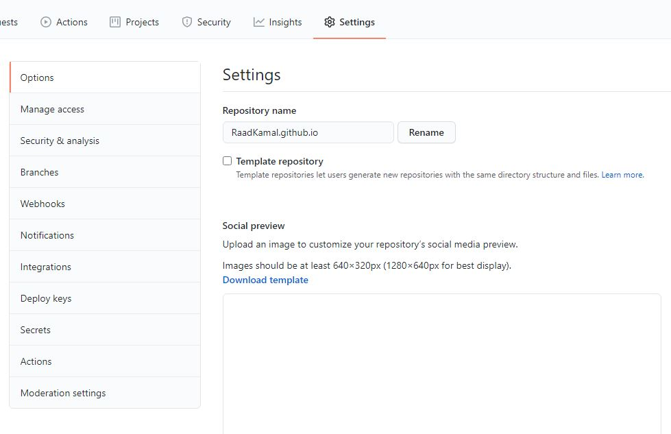

# Hosting Markdown-formatted resume on Github  

The procedure doesn't require any pre-skills on programming. All I need from you is your eminent focus for only 10 minutes, if you have already had the prerequisites completed. It is supposed to be easier than installing an application on your operating system.

##  Purpose : 
The practical steps of how to host and format a resume using Markdown, a Markdown editor, GitHub Pages, and Jekyll.

## Why would you want to host a resume online? 
The answer is short and simple, you want to market yourself to the world. No one would know our skills, knowledge, and experience unless we had a way to inform. And with having an online resume, we can reach more recruiters which unlocks additional possibilities of getting hired. 

## Prerequisite:

### Markdown
Markdown is a lightweight markup language with plain-text-formatting syntax, created in 2004 by John Gruber and Aaron Swartz. Markdown is often used for formatting readme files, writing messages in online discussion forums, and to create rich text using a plain text editor.
Here are some helpful links to start with:
- [Markdown Guide ](https://www.markdownguide.org/basic-syntax/)
- [Download MarkdownPad](https://www.markdownpad.com/)
- [Online Editor](https://dillinger.io/)

### Github 
 A personal GitHub account is required to host your resume. 
 
### Jekyll
There are a lot of Jekyll themes available online. Try them out for saving time:

-https://jamstackthemes.dev/ssg/jekyll/  
-https://jekyllthemes.io/  
-https://jekyll-themes.com/  

if you are not interested in any of the pre-made theme and want to make your template from scratch, I suggest to go over this tutorial, I have found it quite helpful.
-[Jekyll by Mike Dane](https://www.mikedane.com/static-site-generators/jekyll/)

## Instructions:

1.You are likely to have resume in Markdown format up till now. Next, in your GitHub account, upload your resume.md file. However, if you did use Jekyll to format your resume, you can upload the entire folder. The size of the folder has to be less than 25 MB otherwise manual upload of each file is the way to have them get uploaded on GitHub since 25 MB the base upload size for Github.

2.Now, all the files are in one directory and I think the repository is set to public by default. To clear our doubt, we can verify it by going to the settings and if not, make it public.I think only the pro user can set the repo private.

3.Step 3 is to host it online; all .md files have to be in one of the directories in GitHub Pages home repository. Also have to change the Repo name in this special format which is  **`usernameofyourgithub.github.io`**.This is a very important part of the instruction though it takes small effort.

4.You might have already tried your link several times on your web browser but didn't get any motivation; after all the hard works you have put into this tutorial by now. Be patient, it takes few 10 seconds to update the files on the GitHub cloud. Aware of that green checkmark beside your recently edited files, that is an assurance of all set to go. Remember there is a small amount of interval of time after each edit to view the resume. It doesn't happen in real-time.

5.Lastly, it is for you to view your resume on your web browser. Go to the link usernameofyourgithub.github.io. And if I'm not lucky enough at least it diversifies your knowledge.

**Probable errors of not having your resume appeared online.**
Do a meticulous review of my stated steps along with these checks:\
             a)Correct Extension of files,\
             b)Accurate format of GitHub repo name,\
             c)Make it Public repo.
             

### More Resources :

- I would say viewing some raw md formatted codes will obviously help you to learn some basics of Markdown but if you want to learn in-depth and have a hand on practice, this link might help you in both ways.[Markdown Tutorial](https://github.com/sdsawtelle/markdown-resume/blob/master/resume.md)
- This is an excellent book in terms of writing technically. I have utilized some of the concepts of this book to write this beneficial document for you. Grab a copy if you want to know how to document process in an objective manner. ["Modern Technical Writing" by  *Andrew Etter* ](https://www.amazon.ca/Modern-Technical-Writing-Introduction-Documentation-ebook/dp/B01A2QL9SS)
- Still not confident or have some doubts about hosting your resume online, you might want to watch this tutorial [How to host your website on Github ](https://www.youtube.com/watch?v=alMTZlYdIl4&ab_channel=CoffeeCoder)

## Authors and Acknowledgment :
 - ### Mostafa Raad Kamal
    contact: Kamalmr@myumanitoba.ca\
  Thank you to Christena Penner for being a great Professor to help me write this document.

## FAQ:
**Question:** Why is Markdownbetter than a word processor?\
**Answer:**  Unlike a word processor , you have limited options to deal with in Markdown, you will find yourself comfortable using Markdown shortly.\

**Question:** Why is my resume not showing up?\
**Answer:** It can happen, here are several helpful hotfixes: Make sure the repo is public, the file's extension is in the correct format, check your domain name according to the instruction.
